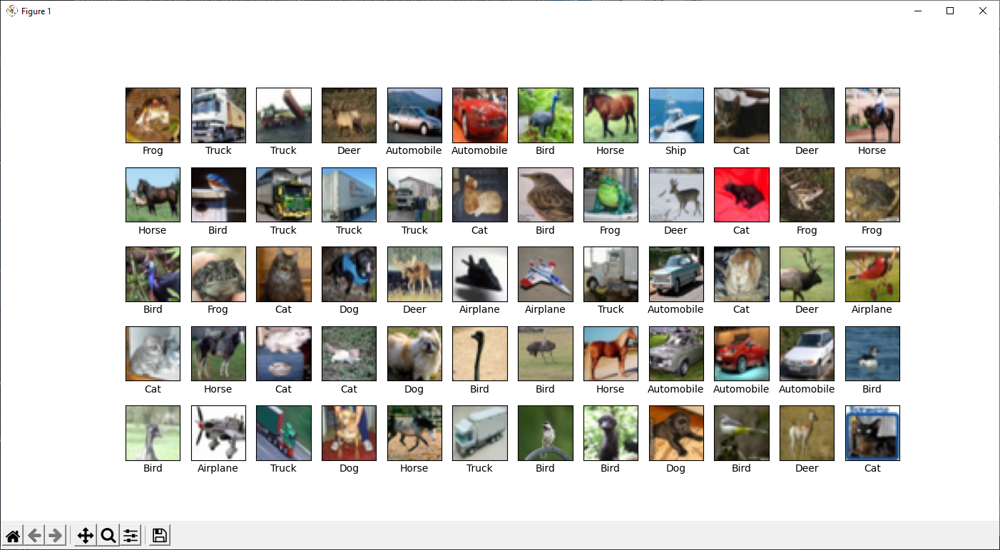

__Modern Computer Architecture and Organization Second Edition__, by Jim Ledin. Published by Packt Publishing.
# Chapter 16, Exercise 2

Create a program using the TensorFlow library that loads the CIFAR-10 dataset and displays a subset of the images along with the label associated with each image. This dataset is a product of the Canadian Institute for Advanced Research (CIFAR) and contains 60,000 images, each consisting of 32x32 RGB pixels. The images have been randomly separated into a training set containing 50,000 images and a test set of 10,000 images. Each image has been labeled by humans as representing an item in one of 10 categories: airplane, automobile, bird, cat, deer, dog, frog, horse, ship, or truck. For more information on the CIFAR-10 dataset, see the technical report by Alex Krizhevsky at https://www.cs.toronto.edu/~kriz/learning-features-2009-TR.pdf.

# Answer
See the python file [Ex__2_load_dataset.py](src/Ex__2_load_dataset.py) for the code to load the dataset and display a subset of the images.

To execute the program, assuming **python** is installed and is in your path, execute the command **python Ex__2_load_dataset.py**

This is the set of sample images displayed by the code:

