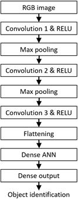

__Modern Computer Architecture and Organization Second Edition__, by Jim Ledin. Published by Packt Publishing.
# Chapter 16, Exercise 3

Create a program using the TensorFlow library that builds a CNN using the structure shown in Figure 16.2. Use a 3x3 convolution filter in each convolutional layer. Use 32 filters in the first convolutional layer and 64 filters in the other two convolutional layers. Use 64 neurons in the hidden layer. There are 10 output neurons representing an image’s presence in one of the 10 CIFAR-10 categories.

# Answer
This is the CNN structure of Figure 16.2:



See the python file [Ex__3_create_network.py](src/Ex__3_create_network.py) for the code to create the CNN model.

To execute the program, assuming **python** is installed and is in your path, execute the command **python Ex__3_create_network.py**

**Note:** You can ignore any warning messages about not having a GPU present if your system doesn't have one. The code will execute on the system processor if a GPU is not configured for use with TensorFlow.

This is the output of a test run:
```
C:\>Ex__3_create_network.py
2021-12-12 19:26:07.938984: I tensorflow/core/platform/cpu_feature_guard.cc:151] This TensorFlow binary is optimized with oneAPI Deep Neural Network Library (oneDNN) to use the following CPU instructions in performance-critical operations:  AVX AVX2
To enable them in other operations, rebuild TensorFlow with the appropriate compiler flags.
2021-12-12 19:26:08.282366: I tensorflow/core/common_runtime/gpu/gpu_device.cc:1525] Created device /job:localhost/replica:0/task:0/device:GPU:0 with 3617 MB memory:  -> device: 0, name: Quadro P2200, pci bus id: 0000:01:00.0, compute capability: 6.1
Model: "sequential"
_________________________________________________________________
 Layer (type)                Output Shape              Param #
=================================================================
 conv2d (Conv2D)             (None, 30, 30, 32)        896

 max_pooling2d (MaxPooling2D  (None, 15, 15, 32)       0
 )

 conv2d_1 (Conv2D)           (None, 13, 13, 64)        18496

 max_pooling2d_1 (MaxPooling  (None, 6, 6, 64)         0
 2D)

 conv2d_2 (Conv2D)           (None, 4, 4, 64)          36928

 flatten (Flatten)           (None, 1024)              0

 dense (Dense)               (None, 64)                65600

 dense_1 (Dense)             (None, 10)                650

=================================================================
Total params: 122,570
Trainable params: 122,570
Non-trainable params: 0
_________________________________________________________________

C:\>
```